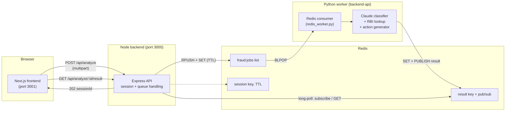

<p align="center">
  
</p>

<h1 align="center">Dekisugi Detects</h1>
<p align="center"><em>Is this a scam? Paste a message, upload a screenshot, or describe a call — get an explainable verdict and exactly what to do next, in under a minute.</em></p>

<p align="center">Built for Problem Statement PS-1 — <strong>Financial safety and consumer protection</strong></p>

---

**Contents:** [Problem](#1-the-problem) · [What it does](#2-what-this-project-does) · [Architecture](#3-architecture) · [Tech stack](#4-tech-stack) · [Repo structure](#5-repository-structure) · [Request flow](#6-how-a-request-actually-flows) · [Fraud taxonomy](#7-fraud-taxonomy--classification) · [RBI data](#8-rbi-lending-app-directory--real-data) · [Zero retention](#9-zero-retention-by-construction) · [Testing](#10-testing) · [Running it](#11-running-it) · [Team split](#12-how-the-team-split-the-work) · [Limitations](#13-known-limitations)

## 1. The problem

Digital payments and instant credit reached Indian households faster than the
knowledge required to use them safely. Fraud now arrives through the same
channels people use every day — SMS, WhatsApp, phone/video calls, app stores
— using well-documented scripts: fake KYC-expiry threats, loan-app contact
harassment, courier/customs fee demands, investment-group screenshots,
"digital arrest" video calls, job-registration fees.

The gap isn't a lack of public warnings. It's that warnings are generic,
scattered, and not retrievable **at the moment someone is looking at a
specific suspicious message**, unsure whether to act. Many victims also
don't know India has a national reporting channel — the **1930 helpline**
and the **National Cybercrime Reporting Portal** — or that a transfer
reported within the first hour can sometimes be reversed.

## 2. What this project does

Dekisugi Detects accepts a **screenshot**, a **pasted message**, an **app
name**, or a **spoken description of a call**, and returns:

- A **verdict** (`likely_scam` / `likely_genuine` / `uncertain`) with a
  confidence score
- The **specific indicators** found (urgency, OTP requests, unofficial
  links, impersonation, threat/intimidation, advance-fee requests, and 10
  more — see [§7](#7-fraud-taxonomy--classification)), each backed by a
  quoted/paraphrased piece of evidence from the input, never invented
- An **immediate action list** for the next 10 minutes
- A **reporting script** — what to have ready before calling 1930 or filing
  on cybercrime.gov.in
- For lending apps: a check against **RBI's real, official directory** of
  digital lending apps deployed by regulated entities

It never asks for or stores an OTP/password, never asserts certainty it
doesn't have, and — critically for a tool that will see genuine bank SMS
as often as scams — is explicitly tuned to keep the false-positive rate on
real institutional communication low (see [§10](#10-testing)).

## 3. Architecture

Two independently-built services communicate **only through Redis** (no
direct HTTP between them), so the Node side and the Python side can be
developed, tested, and deployed independently:



**Why Redis-as-the-only-contract, not a direct API call between backend and
worker:** it keeps the two languages fully decoupled — the worker never
needs to know the backend exists, only that it should `BLPOP fraud:jobs`
and publish a result. The exact wire format is pinned in
**[CONTRACT.md](CONTRACT.md)**, which both sides implement against
independently. This let the Node side (session handling, queue push,
long-poll result retrieval) and the Python side (Claude prompt engineering,
fraud taxonomy, RBI lookup) get built in parallel without blocking on each
other, exactly as the two-track task split required.

## 4. Tech stack

| Layer | Technology | Why |
|---|---|---|
| Frontend | Next.js 16 (App Router, TypeScript), plain CSS | Server + client components, fast dev loop, no heavy UI framework needed |
| Backend | Node.js, Express 5, TypeScript, `ioredis`, `multer`, `zod` | Thin, fast session/queue layer — no business logic lives here on purpose |
| Worker | Python, FastAPI, `anthropic` SDK, Pydantic, `redis-py` | Claude Vision + text classification, structured-output validation |
| Queue / pub-sub | Redis (plain lists + pub/sub, not BullMQ) | Language-agnostic contract between Node and Python — see §3 |
| AI | Claude (Anthropic API), vision-capable model | Single multimodal call classifies text *and* screenshots — no separate OCR step |
| Data | Static JSON, generated from a real RBI export | See [§8](#8-rbi-lending-app-directory--real-data) |
| Infra | Docker Compose (`redis`, `backend`, `worker`, `frontend` services) | One-command local spin-up; see [docker-compose.yml](docker-compose.yml) |

## 5. Repository structure

```
.
├── frontend/            Next.js app — landing page + 4 intake pages + result page
│   ├── app/              page.tsx (landing), message/, screenshot/, call/, app-check/, result/[sessionId]/
│   ├── components/       Nav, ResultCard, Reveal (scroll-in animation)
│   └── lib/               api.ts (backend client), speech.ts (Web Speech API wrapper), types.ts
├── backend/              Express API — session handling, Redis job queue, long-poll result retrieval
│   └── src/               routes/ (analyze, lending, health), services/, queue/, config/
├── backend-api/          FastAPI worker — Claude classification, RBI lookup, action generator
│   ├── app/               routes/analyze.py (standalone HTTP endpoint), redis_worker.py (queue consumer),
│   │                       services/ (claude_service, fraud_classifier, rbi_checker, action_generator, result_adapter),
│   │                       prompts/fraud_prompt.py (system prompt + few-shot taxonomy)
│   ├── data/               taxonomy.json (36 labelled examples), rbi_apps.json (real RBI data),
│   │                       post_incident_procedure.txt (partner-procedure placeholder)
│   └── tests/             pytest suite (25 tests) — schema validation, false-positive suite, error handling
├── data/                 Shared static data: rbi-regulated-lending-apps.json, DigitalLendingApp.xlsx (source), logo.jpeg
├── scripts/              build_rbi_lists.py — regenerates both RBI JSON files from the official export
├── CONTRACT.md           The Redis job/result wire format both services implement against
├── TESTING.md            How to run everything + 8 ready-to-paste test cases
└── docker-compose.yml    redis + backend + worker + frontend, one command
```

## 6. How a request actually flows

1. **Frontend** (`/message`, `/screenshot`, `/call`, or `/app-check`) POSTs a
   `multipart/form-data` request to `POST /api/analyze` on the Node backend.
   For `/call`, any spoken input was already transcribed **client-side** via
   the **Web Speech API** before submission — raw audio never leaves the
   device.
2. **Node backend** (`backend/src/routes/analyze.ts`) generates an ephemeral
   `sessionId` (UUID), writes the job to `session:{id}` with a TTL (default
   5 min — a zero-retention safety net even if nothing ever picks it up),
   and pushes the same job JSON onto the `fraud:jobs` Redis list. Responds
   `202 { sessionId }` immediately.
3. **Frontend** calls `GET /api/analyze/:sessionId/result`, which the
   backend holds open (long-poll, ~25s) while it races a Redis key check
   against a pub/sub subscription — whichever resolves first.
4. **Python worker** (`backend-api/app/redis_worker.py`) is independently
   `BLPOP`-ing the same list. On a job, it runs the exact same
   classification pipeline the worker's own standalone HTTP endpoint uses
   (`fraud_classifier.classify_input` → Claude, with vision support for
   screenshots), plus the RBI lookup and action-list generation, then
   `SET`s and `PUBLISH`es the result back to `result:{sessionId}`.
5. **Node backend** receives the result, **immediately deletes** both the
   result key and the original session key, and returns it to the frontend.
   Nothing about the request persists anywhere past that single response.
6. **Frontend** renders the verdict, indicators, action list, reporting
   script, and (if an app name was given) the RBI match — see
   `components/ResultCard.tsx`.

## 7. Fraud taxonomy & classification

The classification prompt (`backend-api/app/prompts/fraud_prompt.py`) is
grounded in a **36-example labelled corpus** (`backend-api/data/taxonomy.json`)
— 18 scam examples spanning all 8 target categories, and 18 genuine
examples of real bank/utility/courier message formats, used as few-shot
context so the model learns what *legitimate* communication looks like, not
just what fraud looks like:

**Scam categories covered:** KYC Scam · Loan-app harassment · Courier/customs
fee scam · Investment/trading scam · Digital arrest scam · Job
registration/fee scam · Electricity/utility disconnection scam · Bank
impersonation

**Verdict scale:** `HIGH_RISK` / `MEDIUM_RISK` / `LOW_RISK` /
`LIKELY_LEGITIMATE` / `INSUFFICIENT_INFORMATION` — deliberately 5-valued
rather than binary, so genuinely ambiguous input isn't forced into a false
scam/genuine call (see `app/models.py`). The Node/frontend contract maps
this down to `likely_scam` / `likely_genuine` / `uncertain` for display
(mapping table in [CONTRACT.md](CONTRACT.md)).

**16 indicator types** the model can name (never invents ones the input
doesn't support): `urgency`, `threat_intimidation`, `otp_request`,
`credential_request`, `payment_request`, `advance_fee`, `unofficial_link`,
`suspicious_domain`, `impersonation`, `fake_authority`,
`unrealistic_profit`, `job_fee`, `loan_harassment`,
`remote_access_request`, `suspicious_app`, `pressure_to_install_app`.

**Hard safety rules baked into the system prompt** (not just documentation
— see `fraud_prompt.py`): never asks the user to share an OTP/password/PIN
as part of its own guidance; never instructs installing software or moving
money; never claims something is "definitely" a scam or "definitely"
legitimate; never treats a professional logo or formal tone as proof of
legitimacy (impersonation is expected to look convincing).

**Screenshots use Claude's vision capability directly** — the image is sent
to Claude alongside the text prompt in one call; there is no separate OCR
step.

## 8. RBI lending-app directory — real data

The "check this app against RBI's list" feature uses a **real export** of
RBI's public **Digital Lending Apps (DLA) directory** (live on rbi.org.in
since 1 July 2025 under Citizen's Corner), not placeholder data:

- **704 unique app names** / **1,234 entity-app records** (each row also
  carries the regulated entity's name, entity type, and app-store/website
  link)
- Regenerable from a fresh export via **`scripts/build_rbi_lists.py`**,
  which writes both `data/rbi-regulated-lending-apps.json` (used by the
  Node backend's `GET /api/lending-check`) and
  `backend-api/data/rbi_apps.json` (used by the worker's fuzzy-match
  lookup) from one source, so they can't silently drift apart
- RBI's site actively blocks non-browser automated access (its own
  `robots.txt` returns "Unauthorised Access" to a plain request, and the
  directory itself is a JS-only dashboard) — this project doesn't attempt
  to route around that. The export is downloaded by a human, by design;
  the conversion script documents exactly how in its own header comment
- The converter fixes two real data-quality issues found in RBI's own
  export: merged Excel cells that would otherwise silently drop most rows'
  entity attribution, and a handful of self-reporting-entity errors (bare
  digits like `"3"` as an "app name") that are filtered out rather than
  matched against

The API never claims an unlisted app is fraudulent — "not found" is stated
as exactly that, with the list's source and last-updated date always shown
alongside the result.

## 9. Zero retention, by construction

- The frontend never stores a screenshot, message, or transcript anywhere
  except in the in-flight request to the backend.
- The Node backend deletes both Redis keys for a session **the instant** it
  reads the result — not on a timer, as an explicit step in the response
  path (`backend/src/services/resultService.ts`).
- The worst-case retention window is the `SESSION_TTL_SECONDS` /
  `RESULT_TTL_SECONDS` values (default 300s / 120s) — a safety net for a
  job that's pushed but never picked up, not the normal path.
- The Python worker's own logging is deliberately structured to never log
  message text, image bytes, or app names — only high-level events like
  "processing job, type=text" (see `backend-api/app/main.py` and
  `redis_worker.py`).
- No database. No file writes of user input anywhere in either service.

## 10. Testing

Two independent layers of testing exist:

- **`backend-api/tests/`** — 25 automated `pytest` tests (Claude mocked,
  so they run offline/deterministically): JSON-schema validation across
  all 8 scam categories, confidence-range and verdict-enum validation,
  malformed/markdown-fenced model output handling, RBI lookup match /
  no-match / not-found cases, and — the project's explicit judged success
  criterion — a **false-positive suite** that runs every genuine example in
  the taxonomy through the classifier and asserts none come back
  `HIGH_RISK`.
- **[TESTING.md](TESTING.md)** — a manual end-to-end guide with 8
  ready-to-paste test cases (6 real-world scam scripts across categories +
  2 genuine bank/courier messages), plus `curl` commands to exercise the
  backend directly. Three were spot-checked against the **real Claude
  API** (not mocked) during development and came back correct: a KYC-expiry
  phishing text (`likely_scam`, 0.95 confidence), a digital-arrest call
  description (`likely_scam`, 0.97), and a genuine HDFC debit-alert SMS
  (`likely_genuine`, no false positive). The remaining cases are written
  and ready to paste but not yet individually re-verified against a live
  run — worth doing a full pass before a live demo.

## 11. Running it

**Docker Compose (one command):**
```bash
cp .env.example .env   # add your ANTHROPIC_API_KEY
docker compose up --build
```
Frontend at `http://localhost:3001`, backend at `http://localhost:3000`.
Redis is exposed on host port **6380** (not 6379) deliberately — see the
comment in [docker-compose.yml](docker-compose.yml) — to avoid colliding
with any Redis already running on a dev machine's default port.

**Manual dev** (each in its own terminal) and the **full test-case script**:
see [TESTING.md](TESTING.md) — it has exact commands, expected verdicts per
test case, and a troubleshooting section.

## 12. How the team split the work

Built across two tracks in parallel against a shared contract
([CONTRACT.md](CONTRACT.md)), so neither side blocked on the other:

- **Frontend + backend + Redis + infra + demo** — Next.js scaffold, the
  four intake pages (drag-drop screenshot, message paste, call
  description with client-side Web Speech transcription, app check),
  session/queue handling on the Node backend, Docker Compose wiring, RBI
  data sourcing, and the landing page.
- **Fraud worker pool** — FastAPI service, the labelled fraud taxonomy,
  the classification prompt (the highest-leverage piece of the whole
  build), Claude Vision intake, the RBI lookup service, the action-list /
  reporting-script generator, and false-positive tuning.

## 13. Known limitations

- `backend-api/data/post_incident_procedure.txt` is intentionally a
  placeholder — the project brief requires partner-validated procedure
  text before the app states specific official steps verbatim; until a
  partner supplies that text, the reporting script surfaces only generic,
  non-authoritative safety guidance (this is by design, not an oversight
  — see the file's own header).
- The RBI lending-app list (§8) needs to be **refreshed by hand**
  periodically (`scripts/build_rbi_lists.py`) since RBI's directory can't
  be scraped automatically — it will go stale if never re-exported.
- This is advisory only: it does not file reports or contact banks on a
  user's behalf, by design, per the project brief's constraints.

---

<p align="center">Advisory only. If money has already moved, call <strong>1930</strong> or visit <a href="https://cybercrime.gov.in">cybercrime.gov.in</a> immediately.</p>
